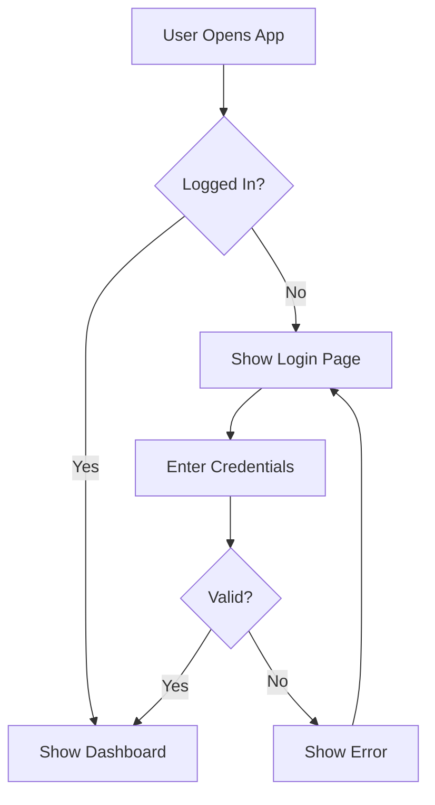

# Mermaid Diagram Generator - Usage Guide

## Overview
The AI-powered Diagram Generator creates beautiful Mermaid diagrams from natural language descriptions.

## Access
- **URL**: http://localhost:5174/diagrams
- **From Dashboard**: Click the "🎨 Diagram Generator" button

## Supported Diagram Types

### 1. Flowchart
**Use for**: Process flows, algorithms, decision trees
**Example Description**: "A user login process with username validation, password checking, and error handling"

### 2. Sequence Diagram
**Use for**: API interactions, message flows, system communications
**Example Description**: "User makes API request to server, server validates token, queries database, and returns response"

### 3. Class Diagram
**Use for**: Object-oriented design, database schemas
**Example Description**: "Classes for User, Product, Order, and Payment in an e-commerce system with relationships"

### 4. State Diagram
**Use for**: State machines, workflow states
**Example Description**: "Order states: pending, processing, shipped, delivered, cancelled with transitions"

### 5. ER Diagram
**Use for**: Database entity relationships
**Example Description**: "Database schema for a blog with Users, Posts, Comments, and Tags tables"

### 6. Gantt Chart
**Use for**: Project timelines, schedules
**Example Description**: "Software development project timeline with design, development, testing, and deployment phases"

### 7. Pie Chart
**Use for**: Data distribution, percentages
**Example Description**: "Market share distribution: Product A 35%, Product B 25%, Product C 20%, Others 20%"

## API Endpoints

### Generate Diagram
```bash
POST /api/diagrams/generate
Authorization: Bearer <token>

{
  "description": "A login process with validation",
  "diagramType": "flowchart",
  "options": {}
}

Response:
{
  "mermaidCode": "graph TD\nA[Start]-->B[Enter Username]",
  "diagramType": "flowchart",
  "description": "A login process with validation"
}
```

### Validate Diagram
```bash
POST /api/diagrams/validate
Authorization: Bearer <token>

{
  "mermaidCode": "graph TD\nA-->B"
}

Response:
{
  "valid": true,
  "message": "Mermaid syntax appears valid"
}
```

## Features

✅ **AI-Powered Generation** - Natural language to Mermaid syntax
✅ **Live Preview** - See your diagram rendered in real-time
✅ **Copy Code** - Copy Mermaid markdown to clipboard
✅ **Download SVG** - Export as scalable vector graphic
✅ **Quick Examples** - Pre-built examples to get started
✅ **Multiple Types** - 7 different diagram types supported
✅ **Rate Limited** - 15 requests per minute for fair usage

## Example Descriptions

### Good Descriptions:
- "Authentication flow with OAuth, token generation, and refresh mechanism"
- "Shopping cart checkout process with payment gateway integration"
- "User registration with email verification and welcome email"
- "Database relationships between users, posts, and comments"

### Tips for Better Results:
1. Be specific about steps/components
2. Mention key decision points
3. Include relationships between entities
4. Specify error handling or edge cases
5. Use clear, descriptive language

## Technical Details

- **Frontend**: React with Mermaid.js library
- **Backend**: Node.js/Express with Ollama AI
- **AI Model**: gpt-oss:120b (optimized for structured output)
- **Rendering**: Client-side Mermaid rendering
- **Export**: SVG format for high-quality graphics

## Rate Limits

- **Diagram Generation**: 15 requests per minute per user
- **Validation**: Unlimited (lightweight operation)

## Browser Support

The diagram generator works best on modern browsers:
- Chrome 90+
- Firefox 88+
- Safari 14+
- Edge 90+

## Mermaid Syntax

Generated diagrams use Mermaid markdown syntax. You can:
1. Copy the code and use it in Markdown files
2. Paste it in GitHub (supports Mermaid in `.md` files)
3. Use in documentation tools that support Mermaid
4. Embed in Notion, Obsidian, or other note-taking apps

## Example Output



## Troubleshooting

### Diagram Not Rendering
- Check browser console for errors
- Ensure Mermaid syntax is valid
- Try regenerating with a clearer description

### API Errors
- Verify you're logged in
- Check rate limits
- Ensure backend server is running

### Poor Quality Output
- Make description more specific
- Try a different diagram type
- Use examples as templates
